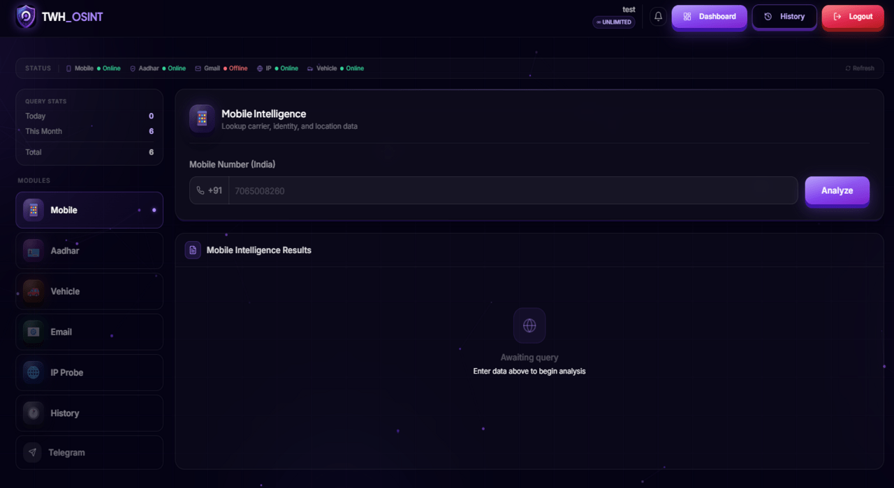
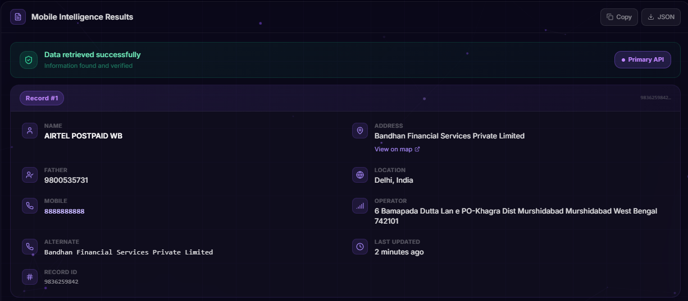
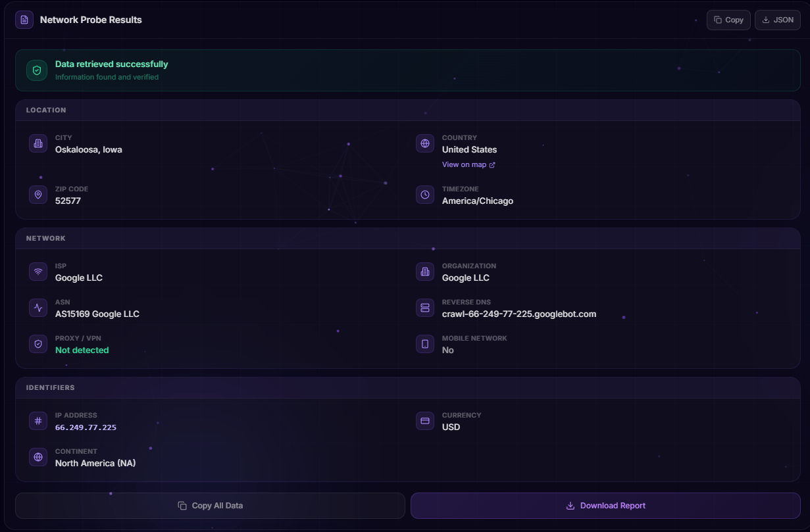
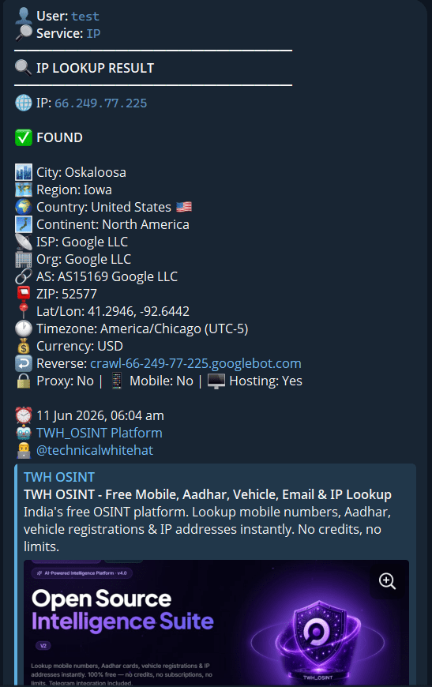

<div align="center">

<!--
  ╔══════════════════════════════════════════════════════════════╗
  ║  📸 IMAGE #1 — MAIN LOGO                                    ║
  ║  File: images/logo.png                                       ║
  ║  Kya hona chahiye: TWH ka shield logo (round, transparent)  ║
  ║  Size: 150x150px recommended                                 ║
  ╚══════════════════════════════════════════════════════════════╝
-->


<!--
  ╔══════════════════════════════════════════════════════════════╗
  ║  📸 IMAGE #2 — BANNER                                       ║
  ║  File: images/banner.png                                     ║
  ║  Kya hona chahiye: Platform ka hero/homepage screenshot      ║
  ║  Ya ek custom banner with "TWH OSINT" text                  ║
  ║  Size: 1280x400px recommended                                ║
  ╚══════════════════════════════════════════════════════════════╝
-->


# ⚡ TWH OSINT — Open Source Intelligence Suite

### *India's Most Powerful Free Intelligence Platform*

[](https://twh-osint.vercel.app/)
[](https://t.me/technicalwhitehat)
[](https://www.youtube.com/channel/UC6itmDFY0MWGfA7_T3yJpkg)

<br/>


<br/>

> **Lookup mobile numbers · Aadhar cards · Vehicle registrations · Email addresses · IP addresses**
>
> **100% Free — No credits, no subscriptions, no limits. Forever.**

</div>

---

## 📋 Table of Contents

- [What is TWH OSINT?](#-what-is-twh-osint)
- [Live Demo](#-live-demo)
- [Platform Screenshots](#-platform-screenshots)
- [Features](#-features)
- [Intelligence Modules](#-intelligence-modules)
- [Platform Architecture](#-platform-architecture)
- [Tech Stack](#-tech-stack)
- [Pages & Routes](#-pages--routes)
- [API Endpoints](#-api-endpoints)
- [About the Founder](#-about-the-founder--technical-white-hat-afsar-ali)
- [Meet the Team](#-meet-the-team)
- [Social Links & Community](#-social-links--community)
- [Privacy & Ethics](#-privacy--ethics)
- [Contact](#-contact)

---

## 🔍 What is TWH OSINT?

**TWH OSINT** is India's most powerful free Open Source Intelligence platform, built and maintained by **Afsar Ali (Technical White Hat)**. It gives anyone — security researchers, journalists, fraud victims, and curious minds — access to real-time intelligence lookups across five major data categories.

```
 ████████╗██╗    ██╗██╗  ██╗     ██████╗ ███████╗██╗███╗   ██╗████████╗
    ██╔══╝██║    ██║██║  ██║    ██╔═══██╗██╔════╝██║████╗  ██║╚══██╔══╝
    ██║   ██║ █╗ ██║███████║    ██║   ██║███████╗██║██╔██╗ ██║   ██║
    ██║   ██║███╗██║██╔══██║    ██║   ██║╚════██║██║██║╚██╗██║   ██║
    ██║   ╚███╔███╔╝██║  ██║    ╚██████╔╝███████║██║██║ ╚████║   ██║
    ╚═╝    ╚══╝╚══╝ ╚═╝  ╚═╝     ╚═════╝ ╚══════╝╚═╝╚═╝  ╚═══╝   ╚═╝
                       Open Source Intelligence Suite V2
                           twh-osint.vercel.app
```

### Why TWH OSINT?

| Feature | TWH OSINT | Other Tools |
|---|---|---|
| 💰 Cost | **100% Free Forever** | Paid / Credits |
| ⚡ Speed | **< 1 Second** | 3–10 seconds |
| 🔐 Privacy | **7-Day Auto-Delete** | Data retained indefinitely |
| 📲 Telegram | **Built-in Integration** | Not available |
| 🔄 Limits | **Unlimited Searches** | Daily caps apply |
| 🛠️ Admin Panel | **Full Platform Control** | None |

---

## 🌐 Live Demo

> **🚀 Visit the live platform:** [https://twh-osint.vercel.app/](https://twh-osint.vercel.app/)

| Environment | URL | Status |
|---|---|---|
| 🌐 Production | [twh-osint.vercel.app](https://twh-osint.vercel.app/) | ✅ Live |
| 🔁 Mirror | [twh-osint.onrender.com](https://twh-osint.onrender.com/) | ✅ Live |
| 💻 Backend | Replit (Node.js + Express) | ✅ Running |
| 🗄️ Database | Supabase (PostgreSQL) | ✅ Connected |

---

## 📸 Platform Screenshots

<!--
  ╔══════════════════════════════════════════════════════════════════╗
  ║  📸 IMAGE #3 — HOMEPAGE / DASHBOARD SCREENSHOT                  ║
  ║  File: images/dashboard.png                                      ║
  ║  Kya hona chahiye: Dashboard page ka full screenshot             ║
  ║  (woh page jahan Mobile/Aadhar/Vehicle/Email/IP cards hain)     ║
  ║  Size: full width screenshot (1280x720 ya full page)            ║
  ╚══════════════════════════════════════════════════════════════════╝
-->

**Dashboard — All Lookup Modules**


<br/>

<!--
  ╔══════════════════════════════════════════════════════════════════╗
  ║  📸 IMAGE #4 — MOBILE NUMBER LOOKUP RESULT                      ║
  ║  File: images/mobile-lookup.png                                  ║
  ║  Kya hona chahiye: Ek mobile number search ka result screenshot  ║
  ║  (operator, circle, SIM type wala result card)                  ║
  ╚══════════════════════════════════════════════════════════════════╝

  ╔══════════════════════════════════════════════════════════════════╗
  ║  📸 IMAGE #5 — VEHICLE / IP LOOKUP RESULT                       ║
  ║  File: images/vehicle-lookup.png  OR  images/ip-lookup.png      ║
  ║  Kya hona chahiye: Kisi ek lookup ka result card screenshot     ║
  ╚══════════════════════════════════════════════════════════════════╝
-->

| Mobile Number Lookup | Vehicle / IP Lookup |
|---|---|
|  |  |

<br/>

<!--
  ╔══════════════════════════════════════════════════════════════════╗
  ║  📸 IMAGE #6 — TELEGRAM INTEGRATION SCREENSHOT                  ║
  ║  File: images/telegram.png                                       ║
  ║  Kya hona chahiye: Telegram pe result aane ka screenshot        ║
  ║  Ya platform mein Telegram linking wala UI                      ║
  ╚══════════════════════════════════════════════════════════════════╝
-->

**Telegram Integration — Results delivered directly to your chat**


---

## ✨ Features

<table>
<tr>
<td width="50%">

### 🔍 Intelligence Lookups
- 📱 **Mobile Number** — Operator, circle, SIM type
- 🛡️ **Aadhar Card** — Verification & status
- 🚗 **Vehicle Registration** — Owner, RC, insurance
- 📧 **Email Address** — Breach records, linked accounts
- 🌐 **IP Address** — Geo, ISP, ASN, routing

</td>
<td width="50%">

### 🔧 Platform Features
- 📲 **Telegram Integration** — Results delivered to your chat
- 🔔 **Real-time Broadcasts** — SSE-powered notifications
- 🕐 **7-Day Auto-Delete** — Privacy by design
- ⚡ **WebSocket Admin Feed** — Live activity monitoring
- 🚨 **Protected Numbers** — Fullscreen siren alert system

</td>
</tr>
<tr>
<td width="50%">

### 🛡️ Security & Access
- 🔐 **Firebase Auth** — Google Sign-in + Email login
- 👤 **User Management** — Block, limit, manage users
- 🔒 **Admin Panel** — Full platform control
- 🌐 **PWA Support** — Installable as a mobile app
- 📊 **Query Analytics** — Stats, charts & DB monitoring

</td>
<td width="50%">

### 💡 User Experience
- ⚡ **Sub-1s Response Time** — Optimized caching layer
- 🎨 **Premium Purple UI** — Dark AI SaaS aesthetic
- 📜 **Search History** — Personal 7-day logs
- 📢 **Broadcast System** — Admin → user messages (SSE)
- 🆓 **Zero Cost Forever** — No hidden fees, ever

</td>
</tr>
</table>

---

## 🧩 Intelligence Modules

### 📱 1. Mobile Number Lookup
Enter any **10-digit Indian mobile number** to instantly retrieve:
- ✅ Telecom Operator (Jio, Airtel, Vi, BSNL)
- ✅ Location Circle / State
- ✅ SIM Type (Prepaid / Postpaid)
- ✅ Number Series & Network Routing Data

### 🛡️ 2. Aadhar Card Verification
Verify any **12-digit Aadhar number** to get:
- ✅ Registration Status
- ✅ Age Verification
- ✅ Linked Details via secure, encrypted data streams

### 🚗 3. Vehicle Registration Lookup
Enter any **Indian vehicle registration number** (e.g. `MH12AB1234`) to get:
- ✅ Owner Name
- ✅ RC Status & Insurance Validity
- ✅ Fuel Type, Vehicle Class, Maker & Model
- ✅ Registration Date

### 📧 4. Email Address Search *(New)*
Search any email address to discover:
- ✅ Data Breach Records
- ✅ Linked Social Media Accounts
- ✅ Associated Identity Information
- ✅ Scammer / Fraudster Tracing

### 🌐 5. IP Address Probe
Deep intelligence on any IPv4/IPv6 address:
- ✅ Geolocation (Country, City, Latitude/Longitude)
- ✅ ISP & Hostname Details
- ✅ ASN & Organization
- ✅ Network Routing Information

### 📲 6. Telegram Integration *(Built-in)*
- Link your Telegram account to the platform in one step
- All search results delivered directly to your Telegram chat
- Admin broadcasts delivered to all connected users
- Works with any Telegram bot configuration

---

## 🏗️ Platform Architecture

```
┌──────────────────────────────────────────────────────────┐
│                     CLIENT (Browser)                      │
│   React 18 + TypeScript + Vite + Tailwind + shadcn/ui    │
│      Firebase Auth SDK  │  TanStack Query  │  Wouter      │
└──────────────────────────┬───────────────────────────────┘
                           │  HTTPS / WebSocket / SSE
┌──────────────────────────▼───────────────────────────────┐
│                    SERVER (Replit)                         │
│            Node.js + Express + TypeScript                  │
│   Firebase Admin SDK  │  Telegram Bot API  │  WebSockets  │
└───────────────┬──────────────────────┬────────────────────┘
                │                      │
   ┌────────────▼────────┐   ┌─────────▼──────────────┐
   │  PostgreSQL          │   │   Firebase Auth         │
   │  (Supabase)          │   │   (Google / Email)      │
   │  Drizzle ORM         │   │   Firebase Admin SDK    │
   └────────────┬────────┘   └────────────────────────┘
                │
   ┌────────────▼────────┐
   │  Telegram Bot API    │
   │  Admin Alerts        │
   │  User Result Deliver │
   │  7-day CSV Reports   │
   └─────────────────────┘
```

### 🔄 Key Backend Systems

| System | TTL / Trigger | Description |
|---|---|---|
| **Service Status Cache** | 5 seconds | Real-time API health monitoring |
| **Service Config Cache** | 15 seconds | Admin-controlled feature toggles |
| **WebSocket Admin Feed** | Real-time | Live query stream for admin dashboard |
| **SSE Broadcast** | On-demand | Server-Sent Events for user notifications |
| **7-Day Cleanup Scheduler** | Day 7/14/21/28 | Auto-purges logs + sends CSV to admins |
| **Protected Numbers** | Instant | Triggers fullscreen siren on restricted search |

---

## 🛠️ Tech Stack

### Frontend


### Backend


### Database & Auth


### Integrations & Deployment


---

## 📄 Pages & Routes

| Route | Page | Description |
|---|---|---|
| `/` | 🏠 Home | Hero section, platform overview, feature highlights |
| `/dashboard` | 📊 Dashboard | All 5 lookup modules + Telegram account linking |
| `/history` | 📜 History | Personal 7-day search history |
| `/twh` | 👤 TWH Profile | Full profile of Afsar Ali & team |
| `/about` | 👥 About Us | Team info, mission, YouTube channel |
| `/contact` | 📬 Contact | Email, Telegram channels, FAQ |
| `/privacy` | 🔒 Privacy Policy | Data handling & privacy commitments |
| `/terms` | 📋 Terms of Service | Usage terms & legal information |

---

## 🔌 API

The platform exposes a RESTful API for the core intelligence services. All lookup endpoints require Firebase authentication.

| Method | Endpoint | Description |
|---|---|---|
| `POST` | `/api/services/mobile` | Mobile number lookup |
| `POST` | `/api/services/aadhar` | Aadhar card verification |
| `POST` | `/api/services/vehicle` | Vehicle registration lookup |
| `POST` | `/api/services/email` | Email address search |
| `POST` | `/api/services/ip` | IP address probe |

---

## 👤 About the Founder — Technical White Hat (Afsar Ali)

<div align="center">

<!--
  ╔══════════════════════════════════════════════════════════════════════╗
  ║  📸 IMAGE #7 — AFSAR ALI (TECHNICAL WHITE HAT) PHOTO              ║
  ║  File: images/afsar-ali.jpg                                         ║
  ║  Kya hona chahiye: Afsar Ali ki personal photo ya avatar           ║
  ║  Ya TWH logo ke saath ek profile image                             ║
  ║  Size: 120x120px (round shape mein dikhega)                        ║
  ╚══════════════════════════════════════════════════════════════════════╝
-->


```
╔═══════════════════════════════════════════════════════╗
║              TECHNICAL WHITE HAT (TWH)                ║
║                     Afsar Ali                          ║
║           Born: 10 May 2004  ·  India                 ║
║      Started in Tech: 2016 (Age 12, Class 6)          ║
║            Self-Taught · School Dropout                ║
║         "Real skills matter more than certificates"    ║
╚═══════════════════════════════════════════════════════╝
```

</div>

### 🎭 Known By Many Names

| Alias | Context |
|---|---|
| **Technical White Hat** | Professional / Platform identity |
| **TWH** | Short form, most used handle |
| **Ahmar Bhai** | Cybersecurity community nickname |
| **908 Hacker** | Early hacking community alias |
| **Brock** | Developer community alias |
| **GeekmUX** | Alternative developer handle |

### 📖 His Story

**Afsar Ali** is one of India's most remarkable self-taught ethical hackers and full-stack developers. His journey began in **2016** when he was just **12 years old**, studying in Class 6. At the time when Jio's 4G revolution was reshaping India's internet landscape, young Afsar recognized the opportunity and began teaching himself hacking and web development — **entirely on his own, with zero formal training**.

He is a proud **school dropout after 12th grade** — a deliberate choice. His philosophy: *real skills matter more than certificates*. This mindset led him to build tools that rival paid software, offered completely free to anyone who needs them.

What makes TWH truly legendary is his personality: **calm, patient, and humorous** — almost impossible to provoke. He is known for making coding approachable with comedy and a relaxed style, even while building enterprise-grade systems.

> *"Build premium tools and give them to the world for free."* — Technical White Hat

### 🏆 Timeline

```
2016  ──► Started tech journey at age 12 (Class 6, during Jio 4G era)
2018  ──► First ethical hacking experiments & self-learning
2020  ──► Started building OSINT & security tools
2022  ──► Founded Technical White Hat (TWH) community
2024  ──► Launched TWH OSINT V1
2025  ──► Launched TWH OSINT V2 — major upgrade (new UI, Telegram, unlimited)
2026  ──► 10,000+ users · 50,000+ queries · 1,00,000+ data sources
```

### 💼 Skills & Expertise


### 🚀 Projects by Technical White Hat

| Project | Type | Description |
|---|---|---|
| **TWH OSINT** | 🔍 Intelligence Platform | India's flagship free OSINT tool (this project) |
| **Hevi Explorer** | 📁 File Transfer | P2P file transfer application |
| **AeroGrab** | 🛠️ Utility Tool | Security/grabber utility tool |
| **Rhythm Music** | 🎵 Music App | Music streaming application |

---

## 👥 Meet the Team

### 🔷 Technical White Hat (Afsar Ali) — Founder & Lead Developer

```
Role         │ Founder · Creator · Lead Developer · Owner
Real Name    │ Afsar Ali
Born         │ 10 May 2004, India
Tech Since   │ 2016 (age 12)
Philosophy   │ Premium tools, free for everyone
```

**Responsibilities:**
- Full platform development & system architecture
- Full-stack engineering (frontend + backend + database)
- OSINT research & intelligence tool building
- Performance optimization & system design
- Open-source project maintenance
- Community leadership & YouTube content creation

---

### 🔷 Sckeptic (Prince) — Senior Administrator

<!--
  ╔══════════════════════════════════════════════════════════════════════╗
  ║  📸 IMAGE #8 — SCKEPTIC (PRINCE) PHOTO  (OPTIONAL)                ║
  ║  File: images/sckeptic.jpg                                          ║
  ║  Kya hona chahiye: Sckeptic (Prince) ki photo ya avatar            ║
  ║  Agar photo nahi deni to yeh img tag hata sakte ho                 ║
  ║  Size: 100x100px recommended                                        ║
  ╚══════════════════════════════════════════════════════════════════════╝
-->
<div align="center">

</div>

```
Role         │ Senior Administrator · Support Team Member
Known As     │ Prince
Badges       │ SR. ADMIN · SUPPORT · ETHICAL HACKER · WEB DEV
```

**Responsibilities:**

| Area | What He Does |
|---|---|
| 🖥️ Platform Administration | End-to-end oversight, service monitoring, configurations |
| 🔒 Security Operations | Security-first reviews, risk identification, safe ops standards |
| 🔧 Technical Troubleshooting | Diagnoses API failures, backend errors, UI bugs |
| 👥 User Support | Handles queries, resolves tickets, community coordination |
| ⚡ Systems & Automation | Backend automation, workflow optimization, efficiency |
| 🌐 Web Development | Direct contributions to platform code & features |
| 🔄 Platform Maintenance | Uptime monitoring, coordinated updates, reliability |
| ✅ Quality Assurance | Ensures every tool and lookup operates to the highest standard |

**Expertise:**


---

## 📡 Social Links & Community

<div align="center">

| Platform | Link | Purpose |
|---|---|---|
| 🌐 **Platform** | [twh-osint.vercel.app](https://twh-osint.vercel.app/) | Main OSINT platform |
| 📺 **YouTube** | [Technical White Hat](https://www.youtube.com/channel/UC6itmDFY0MWGfA7_T3yJpkg) | Cybersecurity tutorials in Hindi |
| 📢 **Telegram Channel** | [t.me/technicalwhitehat](https://t.me/technicalwhitehat) | Platform updates & announcements |
| 👥 **Telegram Group** | [t.me/Technical_whitehat](https://t.me/Technical_whitehat) | Community discussions |
| 📧 **Email** | [mrwhitehath@gmail.com](mailto:mrwhitehath@gmail.com) | Business, partnerships & support |
| 💻 **GitHub** | [github.com/darkpandat/osint](https://github.com/darkpandat/osint) | Source code |

</div>

### 📺 YouTube Channel — Technical White Hat

<!--
  ╔══════════════════════════════════════════════════════════════════════╗
  ║  📸 IMAGE #9 — YOUTUBE CHANNEL BANNER / THUMBNAIL  (OPTIONAL)     ║
  ║  File: images/youtube-banner.png                                    ║
  ║  Kya hona chahiye: YouTube channel ka banner ya koi popular        ║
  ║  video ka thumbnail                                                 ║
  ║  Size: 1280x360px for banner                                        ║
  ╚══════════════════════════════════════════════════════════════════════╝
-->

The **Technical White Hat** YouTube channel is India's leading ethical hacking channel, teaching cybersecurity **in Hindi (हिंदी)** to make it accessible to every Indian. Content includes:

- 📱 Mobile & IP tracing tutorials
- 🕵️ Scammer exposure techniques
- 🔍 OSINT for beginners — step by step
- 🔴 Live cybersecurity demonstrations
- 🛡️ Digital privacy & protection guides
- 💻 Ethical hacking walkthroughs

> **Language:** Hindi (हिंदी) · **Audience:** Indian cybersecurity enthusiasts, students & professionals

---

## 🔒 Privacy & Ethics

### 7-Day Auto-Delete Policy

```
┌──────────────────────────────────────────────────────┐
│                7-DAY AUTO-DELETE POLICY               │
│                                                       │
│  All search logs & login activity are automatically  │
│  purged on day 7, 14, 21, 28, and last of the month  │
│                                                       │
│  Before each purge:                                   │
│   1. Admin receives a full CSV export via Telegram   │
│   2. All logs are permanently deleted from database  │
│                                                       │
│  We do NOT sell or share your data with anyone.      │
└──────────────────────────────────────────────────────┘
```

### ⚠️ Legal Disclaimer

> **TWH OSINT is designed for:**
> - Helping victims identify and expose scammers & fraudsters
> - Security research and educational purposes
> - Digital literacy, OSINT learning & awareness
>
> **Misuse for illegal purposes is strictly prohibited.**
> Users are solely responsible for how they use this tool.
> All data accessed is from publicly available sources only.

### ❓ FAQ

<details>
<summary><strong>Is TWH OSINT completely free?</strong></summary>

Yes. TWH OSINT V2 is **100% free** — no credit system, no subscriptions, no hidden charges. Unlimited searches for all users, forever.
</details>

<details>
<summary><strong>Is this platform legal to use?</strong></summary>

TWH OSINT uses publicly available data sources for educational and research purposes. Users are responsible for ensuring their queries comply with applicable laws. Misuse is strictly prohibited.
</details>

<details>
<summary><strong>How is my data protected?</strong></summary>

We store only the minimal data required for authentication. Query logs are retained for 7 days for audit purposes and then permanently and automatically deleted. We do not sell or share your data.
</details>

<details>
<summary><strong>Can I use this for commercial purposes?</strong></summary>

TWH OSINT is designed for personal research and educational use. For commercial licensing or API access, please contact us at mrwhitehath@gmail.com.
</details>

<details>
<summary><strong>How do I report a bug or issue?</strong></summary>

Email us at **mrwhitehath@gmail.com** or reach out via our Telegram group at **t.me/Technical_whitehat**. We typically respond within 24–48 hours.
</details>

---

## 📞 Contact

| Method | Details | Response Time |
|---|---|---|
| 📧 **Email** | [mrwhitehath@gmail.com](mailto:mrwhitehath@gmail.com) | 24–48 hours |
| 📢 **Telegram Channel** | [t.me/technicalwhitehat](https://t.me/technicalwhitehat) | Instant (updates) |
| 👥 **Telegram Group** | [t.me/Technical_whitehat](https://t.me/Technical_whitehat) | Within hours |
| 📺 **YouTube** | [Technical White Hat](https://www.youtube.com/channel/UC6itmDFY0MWGfA7_T3yJpkg) | — |

> 🕙 **Active Hours (IST):** 10:00 AM – 10:00 PM (Indian Standard Time)

---

<div align="center">

## ⚡ Platform Stats

| Metric | Value |
|---|---|
| 👥 Active Users | **10,000+** |
| 🔍 Queries Processed | **50,000+** |
| 🗄️ Data Sources | **1,00,000+** |
| ⏱️ Avg Response Time | **< 1 Second** |
| ✅ Platform Uptime | **99.9%** |
| 📅 Founded | **2022** |
| 💰 Cost | **Forever Free** |

---

<br/>

**Made with ❤️ in India by [Technical White Hat (Afsar Ali)](https://twh-osint.vercel.app/twh)**

*"Premium tools for everyone — free, fast, and forever."*

<br/>

[](https://twh-osint.vercel.app/)
[](https://t.me/technicalwhitehat)
[](https://www.youtube.com/channel/UC6itmDFY0MWGfA7_T3yJpkg)
[](mailto:mrwhitehath@gmail.com)

<br/>

© 2026 TWH OSINT · Technical White Hat (Afsar Ali) · All rights reserved.

</div>
